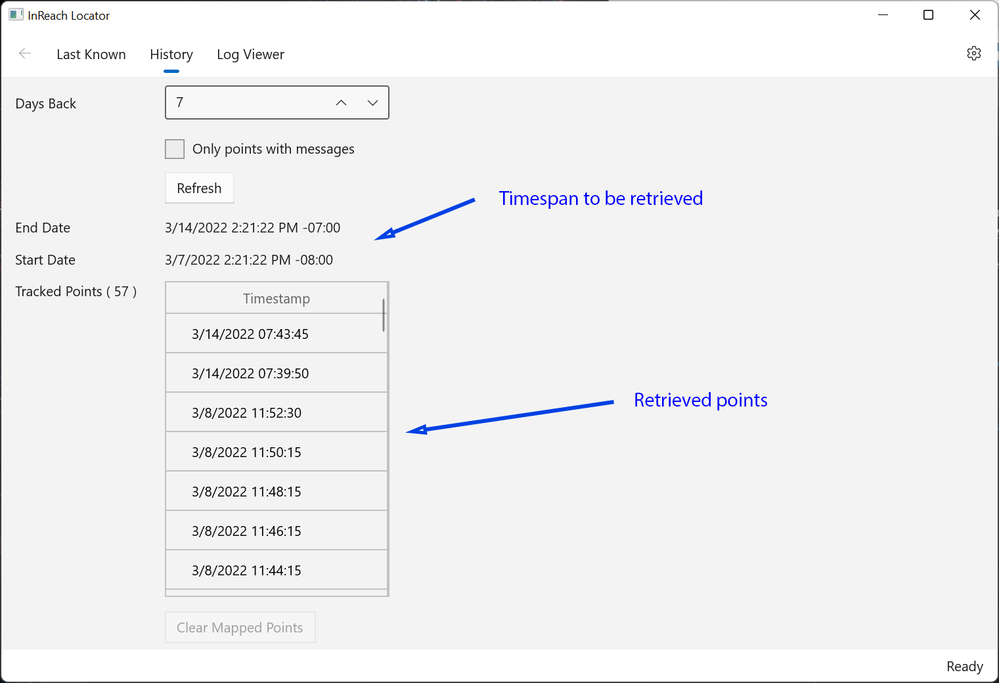
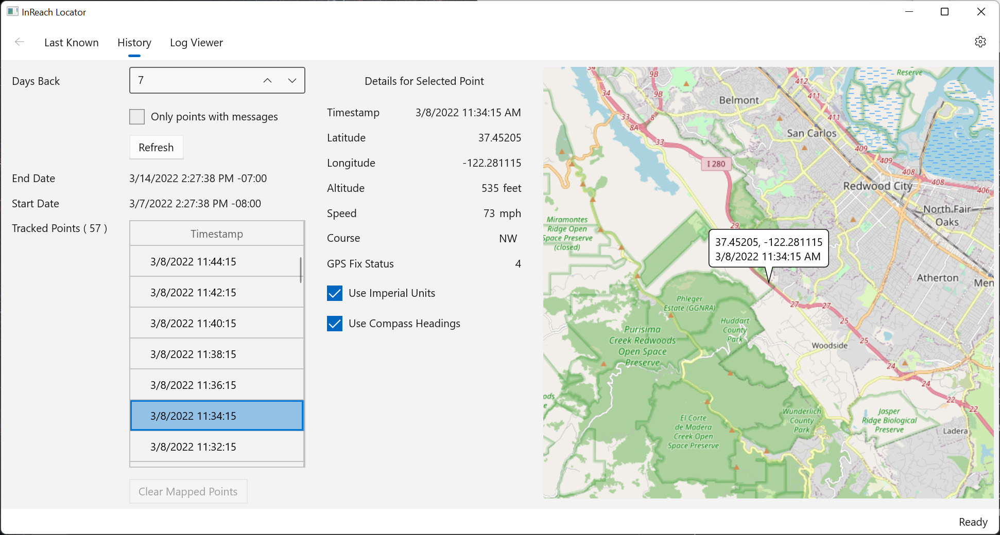
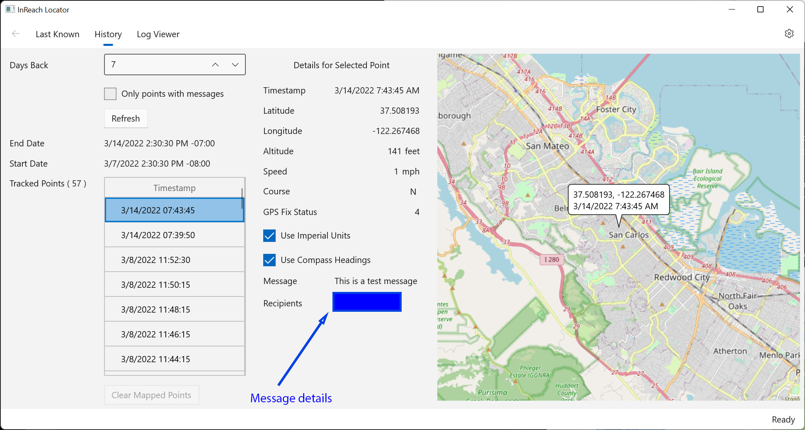
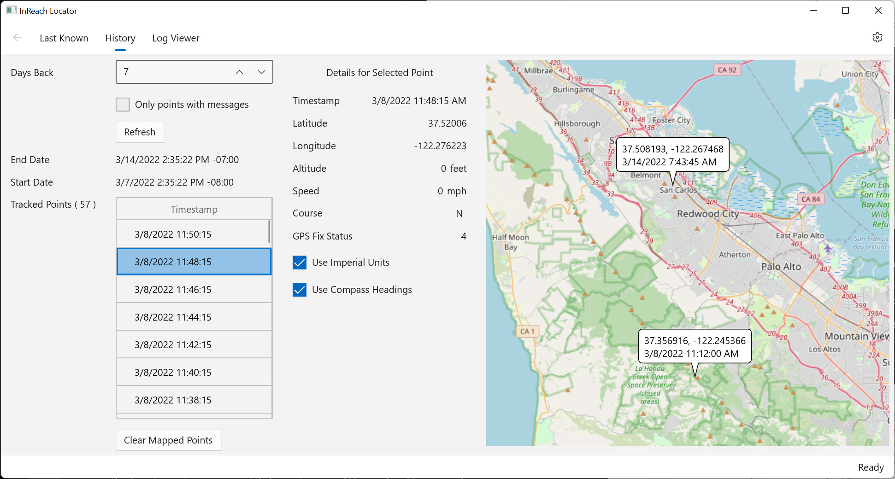

# History

**Navigation**: Home -> History

This displays the history of tracking points:

It may take a few seconds to populate because data has to be retrieved from Garmin's servers.

The **End Date** and **Start Date** fields will update, once a second, to show you the timespan that was retrieved or will be retrieved when you click the **Refresh** button.

By default the history page retrieves everything from the past week. That time frame can be increased by adjusting the Days Back setting. After changing Days Back click the Refresh button to apply the new time frame.

You can also limit what's retrieved to only those tracking points associated with messages sent from the InReach device (all InReach messages are automatically associated with a tracking point whether or not you have tracking enabled on the InReach device).

Checking the box will delete any previously-retrieved points that do **not** have messages associated with them. However, **unchecking** the box will not automatically retrieve "unmessaged" points. You have to click the Refresh button to do that.

## Selecting points

Once points have been retrieved you can see their details by clicking on them:

When selected, a point's details will appear and a map showing the location of the tracking point will display. You may need to expand the window to see all the details and/or the map.

There is one case where the map won't be displayed after clicking a point: some InReach points appear to come from latitude/longitude 0/0. These are ignored by the map display.

The map is pannable (by clicking and dragging it) and zoomable (by using your mouse wheel).

## Points with messages

If a selected point has a message information about the message will appear in the detail view:

The cell phone number of the recipient(s) were hidden in the image for privacy reasons. They show up in the app.

## Setting a point on the map

If you double-click a tracking point you "set" its display on the map. Thereafter, until you unset it by double-clicking it again, it is always displayed on the map. In addition, the map will continually reset its center to the center of all the map points being displayed every time you add a new point to the map.

You may have to zoom and/or pan the map to get all the points to appear in the map.

You can remove all the "set" points by clicking the Clear Map Points button.
