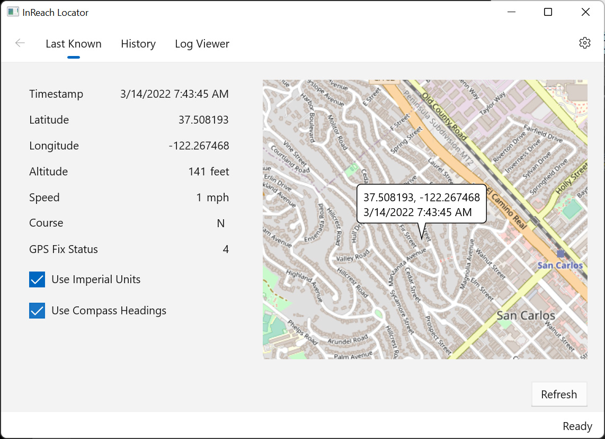

# Last Known

**Navigation**: Home -> Last Known

The Last Known page displays the last known location of your InReach device and information about how the device was moving when the tracking point was created (you have to use the InReach's tracking feature, or use it to send a message, to generate these points):

You can change the units used to display altitude, speed and compass heading by clicking the check boxes below the information display. By default they display in Imperial units (e.g., mph) and compass directions (e.g., N, NNW). You can define the default in the app's configuration.

Clicking the **Refresh** button will update the display if a more recent point was recorded by Garmin's servers.
