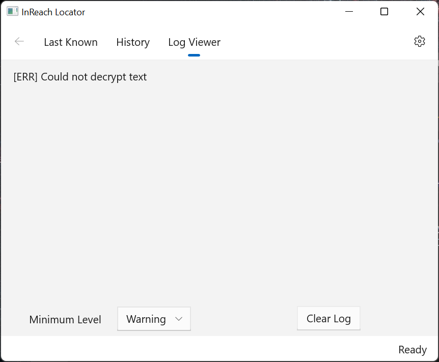

# Log Viewer

**Navigation**: Home -> Log Viewer

This displays a list of logging messages generated by the program as it runs. It's used to help diagnose problems that occur.

You can filter the severity of the log messages displayed by selecting the minimum level from the drop down. The default minimum level can be set in the app's configuration.

Not all the error messages are significant. For example, the one shown in the picture is probably due to a minor programming bug which doesn't affect the program's functionality.
