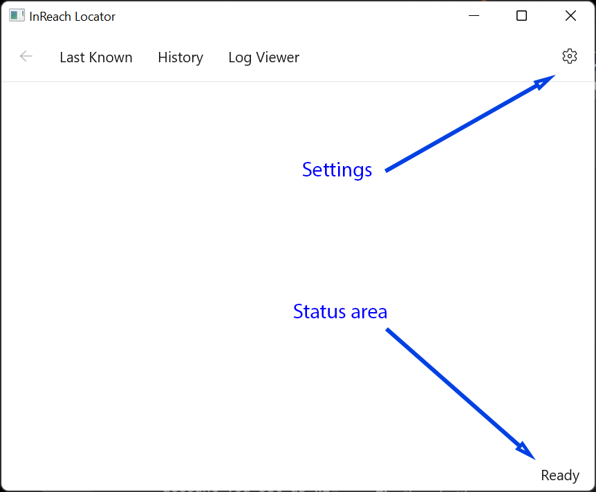
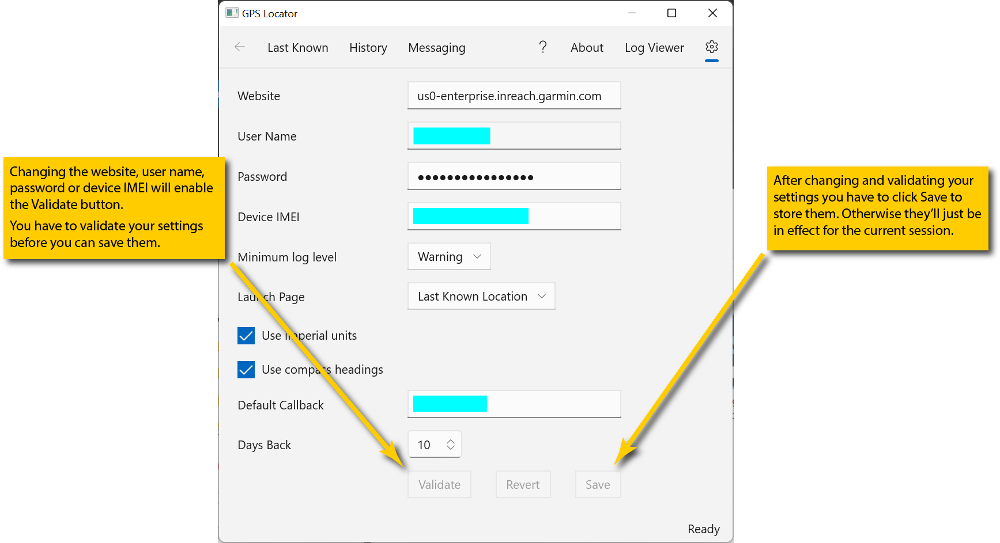

# Initial Setup and Configuration

**Navigation**: Home -> (gear icon)

When the app launches it will look like this:

The first time you run the app it will display a message in the status area that the configurtion is invalid (the picture shows what it will look like after you successfully configure the app):

To configure the app click the gear icon in the upper left corner of the window. This will bring up the configuration page:

Fill out  the fields with information for your InReach device. Note that the app works with one device at a time.

* The **User Name** and **Password** fields come from the web services access account you [set up with Garmin](web-services.md).
* The **IMEI** field identifies your specific InReach device. You can find it on the [Devices](https://explore.garmin.com/Devices) website page. You'll have to log in with your regular Garmin credentials to get to the page.
* The **Website** field identifies the specific website used to access information about your InReach device. This will be provided when you set up your Garmin web services account. It's also available at the [Portal Connect](https://explore.garmin.com/IPC/) website (see [these instructions](web-services.md) for more detail).

Once you have have filled out the fields click the **Validate** button to confirm you have access. If validation fails check the website, user name, password and IMEI fields for errors and correct them. These are the only fields which need to be validated. If you change any of the other settings you can simply save the configuration by clicking the **Save** button.

Once you have successfully validated the configuration click the **Save** button to store the settings on your computer. They will be recalled every time you launch the app so you won't need to re-enter them.

Checking or clearing the **Use imperial units** box sets the default for how altitudes and speeds are displayed. If checked, they'll be in feet and miles per hour. If unchecked they'll be in meters and kilometers per hour (which is the way the InReach actually records them).

Checking or clearing the **Use compass headings** box sets the default for how courses (i.e., directions of movement) are displayed. If checked they'll display as compass headings (e.g., N, NNW). If unchecked they'll display as degrees, with 0 being north.

The **Minimum log level** setting controls the minimum level of log events displayed by the log viewer (see below).